# About Fin the Finder

Fin the Finder is a Mastra-based deep research workspace for analysts who need cited research they can inspect, approve, resume, and improve. It is built for the work after a model answer: source review, claim traceability, contradiction handling, approval history, costs, evals, and report evidence.

```mermaid
flowchart LR
  User["Analyst"] --> Workflow["Mastra research workflow"]
  Workflow --> Planner["Planner agent"]
  Planner --> Search["Exa web search tool"]
  Search --> Evaluate["Source evaluator agent"]
  Evaluate --> Extract["Learning extractor agent"]
  Extract --> Claims["Claim ledger"]
  Claims --> Audit["Contradiction and citation auditors"]
  Audit --> Approval["Human approval gate"]
  Approval --> Report["Report writer and final reviewer"]
  Report --> Export["Cited markdown export"]
```

## Product Promise

Fin treats research artifacts as product data. Sessions, sources, evaluations, learnings, claims, approvals, run events, costs, evals, post-mortems, memory rows, and reports are durable records. That makes a run reviewable and improvable instead of a one-off model answer.

## Mastra Lineage

Fin started from the Mastra deep research template and keeps that lineage explicit. The system maps cleanly to Mastra primitives:

- Agents: planner, research, source evaluator, learning extractor, contradiction checker, citation auditor, report writer, final reviewer, and web summarization.
- Tools: web search, source evaluation, and learning extraction.
- Workflows: research workflow and generate-report workflow.
- Registry: the Mastra entrypoint wires agents, tools, and workflows into one typed orchestration surface.

## Production Hardening

The production layer around the Mastra core includes:

- Next.js 16 product shell and authenticated API routes.
- Supabase schema for sessions, sources, evaluations, learnings, approvals, events, reports, runs, claims, costs, post-mortems, and scoped memory.
- Queued worker execution with leases for long-running research.
- Zod contracts, generated JSON Schema, and drift hashes.
- Offline evals, credential-free orchestration replay, benchmark drift checks, and expected versus actual scenario fixtures.
- Citation and contradiction gates, human approval status, report readiness checks, and provenance-bound demo export.
- Structured Pino logging with redaction, OpenTelemetry trace hooks, cost rows, and post-mortem generation.
- CI, Docker build, Playwright smoke coverage, audit checks, issue templates, PR template, Dependabot, and repo hygiene docs.

## Proof Tier

Fin is offline-gated today. Deterministic contracts, unit coverage, Playwright, Docker build, smoke checks, audit, offline evals, credential-free orchestration replay, and benchmark drift checks are the current release gate.

Configured-provider research is supported when OpenAI, Exa, and Supabase credentials are present. Measured live benchmark rows and recorded live demo evidence are not claimed until `npm run demo:export -- --reporting-run-id <id> --media <path>` creates a Supabase-derived proof bundle and the same real session, research run, reporting run, approval, final audit, media, scenario eval, and cost evidence pass `npm run demo:record`, `npm run evals:live`, and the Live Run Log in `docs/BENCHMARK.md`.

## Release Status

- Current release: `v1.0.0`
- Package version: `1.0.0`
- Health route version: `1.0.0`
- License: Apache-2.0
- Proof tier: offline-gated production foundation
- Live proof: pending configured credentials and recorded media
