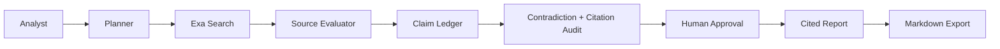

# About Fin The Finder

Fin The Finder exists for research work where a long answer is not enough. Analysts need to know what was searched, which sources were trusted, what claims were extracted, where uncertainty remains, who approved the work, and why a report is ready.

## Product Promise

Fin treats research artifacts as product data: sessions, sources, evaluations, learnings, claims, approvals, events, costs, evals, and reports. That makes a run reviewable and improvable instead of a one-off model answer.

## What Exists Now

- Next.js product shell and authenticated API routes.
- Mastra agents and Exa/OpenAI integration.
- Supabase schema for sessions, sources, evaluations, learnings, approvals, events, and reports.
- Contract generation, offline evals, claim-ledger seed, plateau scorer, cost model, audit-green dependency baseline, queued worker execution, and authenticated UI loaders for sessions, claims, runs, approvals, and reports.

## What Is Still Being Built

OpenTelemetry traces, scoped memory tables, measured live benchmark rows, and recorded live demo evidence are tracked in `docs/FDE_GATES.md`.
